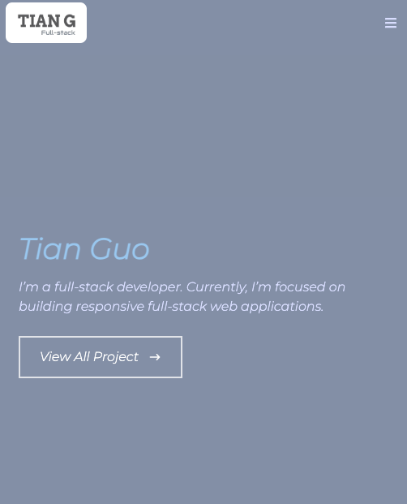
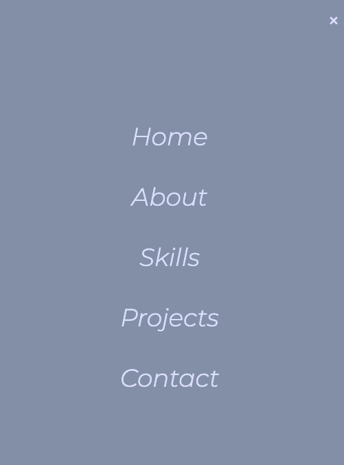
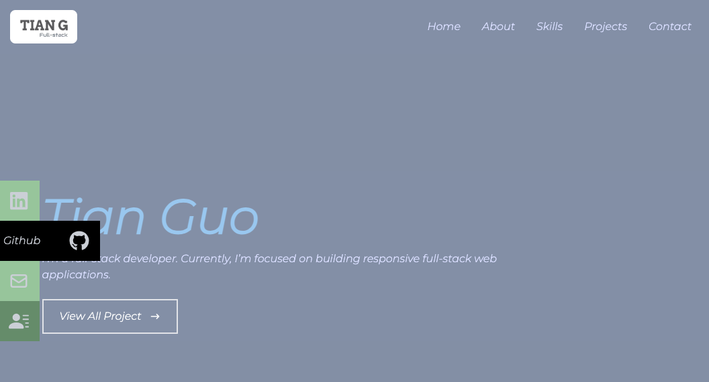

# react_portfolio_tg
react portfolio


## Description
This application is a portfolio using react. 

## Table of Contents
  * [User Story](#user-story)
  * [Installation](#installation)
  * [Heroku Link](#heroku-link)
  * [Application Screenshot](#application-screenshot)
  * [Questions](#questions)  

## User Story
```md
AS AN employer looking for candidates with experience building single-page applications
I WANT to view a potential employee's deployed React portfolio of work samples
SO THAT I can assess whether they're a good candidate for an open position
```

## Installation
- Install required node pacakges by running:
    ```
    npm i
    ```

## Heroku Link
This application is deployed to [Github](https://gtotaku-tg.github.io/react_portfolio_tg)

## Application Screenshot

Mobile View



Pc View



## Questions
If you have any questions, you can find [my Github](https://github.com/gtotaku-tg) and reach me by [email](mailto:gtotaku@live.com)